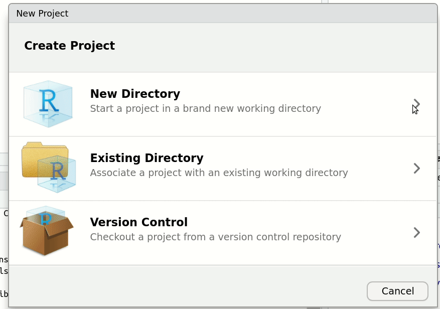
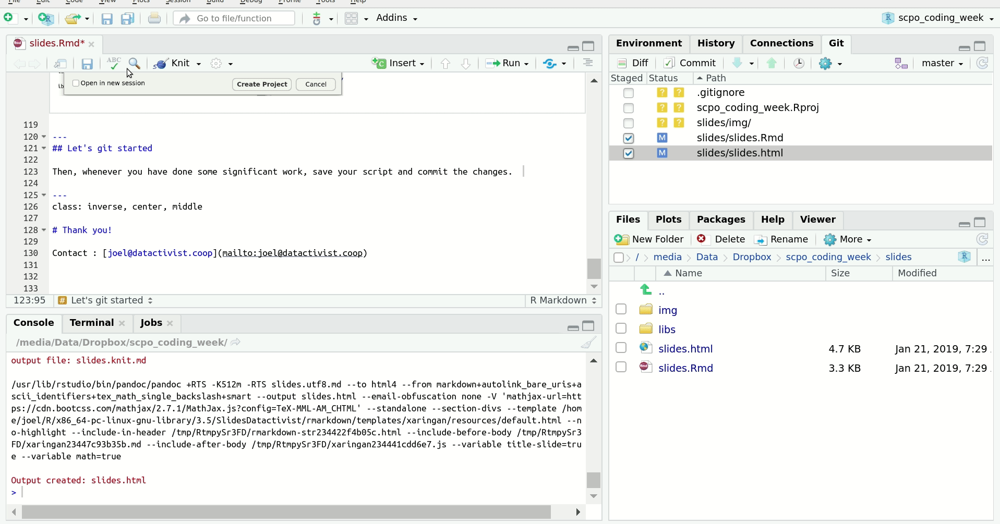
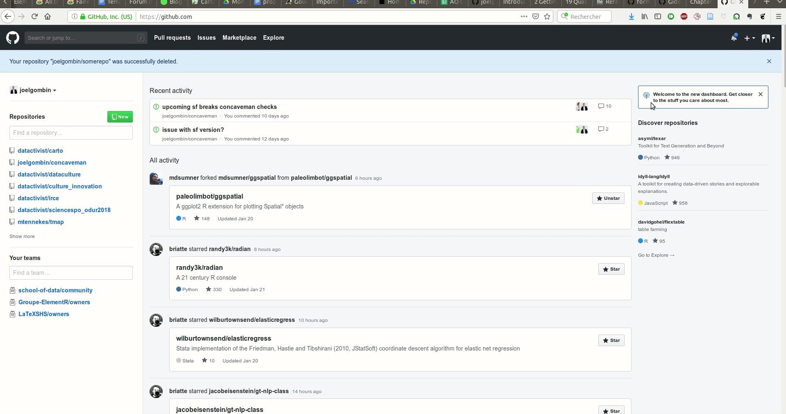

layout: true
  

`r paste0("<div class='my-footer'><span>", params$event, "</span> <center><div class=logo></center></span></div>")` 


---

class: center, middle

Ces slides en ligne : `r paste0("http://datactivist.coop/", params$slug)`

Sources : `r paste0("https://github.com/datactivist/", params$slug)`


Les productions de Datactivist sont librement réutilisables selon les termes de la licence [Creative Commons 4.0 BY-SA](https://creativecommons.org/licenses/by-sa/4.0/legalcode.fr).

<BR>
<BR>


---
## Who are we?

<BR><BR><BR><BR>

[](https://datactivist.coop)

### We .red[open data], we make them .red[useful]

---
## Who are we?


---
## Who are we?

- Datactivist is an open data pure player, created in 2016 by Samuel Goëta and Joël Gombin.

- Operating at all steps of data opening and reuse, Datactivist works with both data producers and data re-users. 

- Our mission : to reduce information asymmetries, and allow everyone to seize data, without naivety, but without pessimism. 

- a research-driven approach: see **https://datactivist.coop/these**. 

- We created the [#TeamOpenData community](https://teamopendata.org).

---
class: inverse, center, middle

# The agenda

---
## The agenda

- using `git` and github to deal with code like a pro

- tidyverse: a refresher

- datavisualisation with `ggplot2`

- mapping data with `banR`, `sf`, `tmap`, `leaflet`...

- using APIs

- wrap-up, tips & tricks

---
class: inverse, center, middle

# Let's get started

---
## Checklist

- Are R and Rstudio correctly installed? (i.e., can you succesfully launch Rstudio?)

- Is git installed on your computer? Do you have a github account? 

---
## Let's git started

If you want to know everything about R and git/github, go visit [this site](https://happygitwithr.com/).

Git : a *version control system*. Think a "Track changes" features for code on steroids!

Github is a web interface, storage space and social network for code managed through git. It is to git what Google Docs is to MS Word.

Git and github are useful for documentation and collaboration. 

---
## Let's git started

First and foremost : **please do use projects in Rstudio**. Then, when you create your project, initiate a git repo too. Using [Rmarkdown](http://rmarkdown.rstudio.com/) is a good idea, too. 

.center[.reduite[]]

---
## Let's git started

Then, whenever you have done some significant work, save your script and commit the changes.  

.reduite[]

---
## Let's git started

Finally, sync your changes with github for backup and potential collaboration. 

.reduite[]

---
class: inverse, center, middle

# Let's get tidy

---
## The datascience workflow

```{r, echo = FALSE, out.width='90%', fig.align='center'}
knitr::include_graphics("./img/data-science-explore.png")
```

---
## Installing the tidyverse

- The `tidyverse` (ou hadleyverse) helps making the workflow working

* In order to install the tidyverse, type: `install.packages("tidyverse")` (or through Rstudio)

* `library(tidyverse)` => loads the package

---
## Importing data

- button "Import dataset"

- through the CLI: the `readr` for CSV, `haven` for SPSS / SAS / Stata, `readxl` for XLS(X), `rio` for (almost) everything else. 

---
## Import your first dataset

- load the package: `library(readr)`

- remember to assign the result: 

  `monjeudedonnees <- read_csv("monfichier.csv")` 

- let's import some data!

---
## Let's play with some data

Download the dataset from https://www.data.gouv.fr/fr/datasets/donnees-du-repertoire-national-des-elus/#resource-community-4e196bc2-6b0a-40e4-b251-4e9e505d55df

```{r }
suppressPackageStartupMessages(library(tidyverse))
rne <- read_csv("./data/Repertoire-national-des-elus.csv")

```

## Let's play with some data

If needed, adjust the import process with arguments `col_types`, `locale` or `na`.

---
## Preparing tidy data

- `dplyr` & `tidyr` mainly

- the pipe: `%>%` (ctrl/cmd + shift + M)

- the verbs: 
  + `filter` (and `slice`)
  + `arrange`
  + `select` (and `rename`)
  + `distinct`
  + `mutate` 
  + `group_by` 
  + `summarise`
  + `sample_n` / `sample_frac`

- `stringr` might be a useful companion if you have to deal with characters/strings

---
## Pivoting

`gather` & `spread`

```{r, echo = FALSE, out.width='90%', fig.align='center'}
knitr::include_graphics("http://r4ds.had.co.nz/images/tidy-9.png")
```

---
## Recoding data

- `recode`

- `case_when`

---
## Merging datasets

- primary keys and foreign keys

- `left_join`
- `right_join`
- `full_join`
- `inner_join`
- `semi_join`
- `anti_join`

---
## Merging datasets

.center[]

.center[]

---
## Inner join

.center[]

---
## Outer joins

.reduite[.center[]]


---
## Semi join

.center[]

---
## Anti join

.center[]


---
## A different matter: binding

- `bind_rows`
- `bind_cols`

---
## dplyr tips & tricks 

```{r}
rne %>% 
  group_by(`Libellé de la profession`) %>% 
  summarise(n = n()) %>% 
  arrange(desc(n))
```

---
---
## dplyr tips & tricks 

```{r}
rne %>% 
  count(`Libellé de la profession`, sort = TRUE) 
```

---
class: inverse, center, middle

# Visualising data with `ggplot2`

---
## The grammar of graphics


- data

- aesthetic mapping (`aes`)

- `layer`s : `geom` and `stat`

- `scale`s

- a `coord`inates system

- small multiples (`facet`)

- a thème (`theme`)

---

---
## The main `geom`s

- `geom_point`

- `geom_line`

- `geom_text`

- `geom_quantile`

- `geom_histogram`

- `geom_density`

- `geom_smooth`

- `geom_bar`

- and even `geom_sf` in conjonction with the `sf` package

---
## the main `aes`thetics

- `x`

- `y`

- `colour`

- `fill`

- `size`

- line width `lwd`

- line type `lty`

---
class: inverse, center, middle

# Thank you!

Contact : [joel@datactivist.coop](mailto:joel@datactivist.coop)


